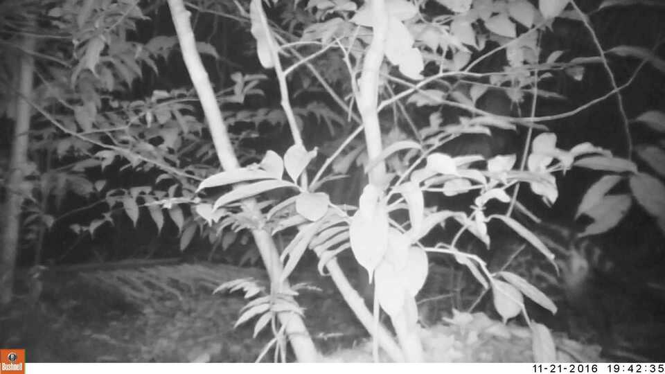
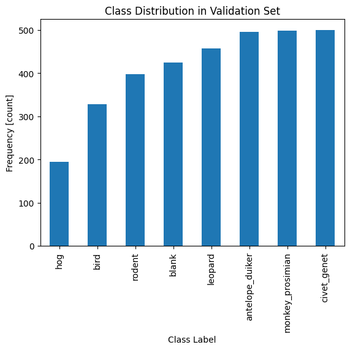
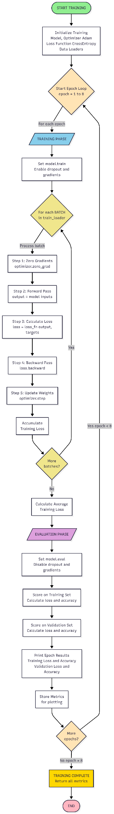
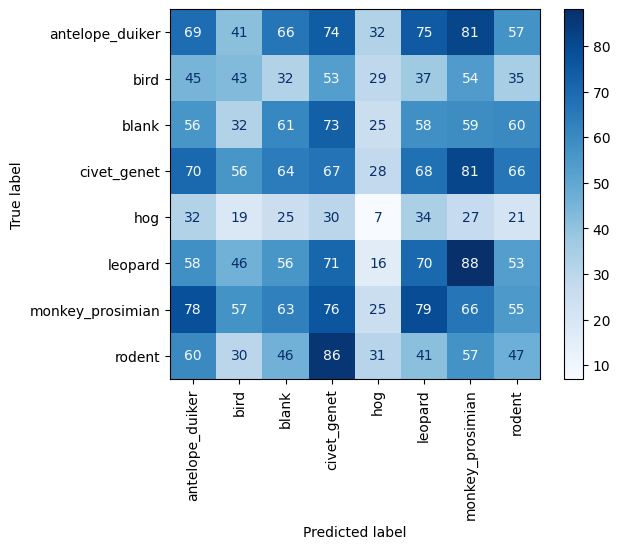
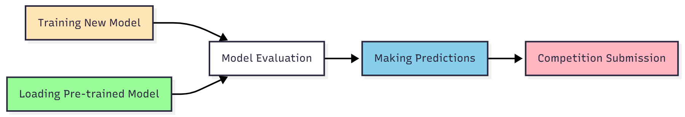
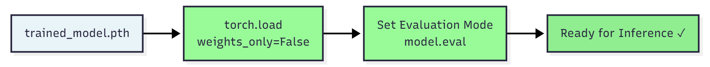
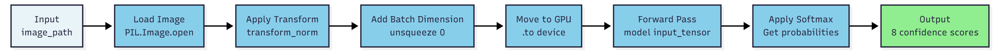

# Automated Wildlife Image Classification Using Convolutional Neural Networks (CNN)

<!-- PROJECT BANNER -->
<p align="center">
  
</p>

<p align="center">
  
  
  
  
  
  
  
  
</p>

---


## Table of Contents
- [Overview](#overview)
- [Project Objectives](#project-objectives)
- [Technical Architecture](#technical-architecture)
- [Dataset Information](#dataset-information)
- [Model Architecture](#model-architecture)
- [Implementation Details](#implementation-details)
- [Training Pipeline](#training-pipeline)
- [Results & Evaluation](#results--evaluation)
- [Installation & Setup](#installation--setup)
- [Usage](#usage)
- [Performance Considerations](#performance-considerations)
- [File Structure](#file-structure)
- [License & Acknowledgements](#license--acknowledgements)

---

## Overview

This project implements a **Convolutional Neural Network (CNN)** for multiclass image classification of wildlife camera trap images. The system can identify eight different categories of animals captured in the wild, providing confidence scores for each classification.

### Key Features
- ✅ Multiclass classification (8 animal categories)
- ✅ Custom CNN architecture with 25M+ trainable parameters
- ✅ Advanced data preprocessing and normalization
- ✅ Dropout regularization for overfitting prevention
- ✅ GPU acceleration support (CUDA/MPS)
- ✅ Comprehensive evaluation with confusion matrices
- ✅ Competition-ready prediction export

---

## Project Objectives

1. **Data Processing**: Transform raw camera trap images into normalized tensors suitable for neural network training
2. **Model Development**: Build and train a deep convolutional neural network for animal classification
3. **Multiclass Classification**: Distinguish between 8 different wildlife categories with high accuracy
4. **Performance Evaluation**: Assess model performance using confusion matrices and accuracy metrics
5. **Deployment**: Generate competition-ready predictions with confidence scores

---

## Technical Architecture

### System Requirements
```
Platform: Linux (CUDA-enabled recommended)
Python: 3.11.0
GPU: CUDA 12.1 compatible device (highly recommended)
RAM: 8GB minimum, 16GB+ recommended
Storage: 5GB+ for dataset and models
```

### Core Dependencies
| Package | Version | Purpose |
|---------|---------|---------|
| torch | 2.2.2+cu121 | Deep learning framework |
| torchvision | 0.17.2+cu121 | Computer vision utilities |
| numpy | Latest | Numerical computations |
| pandas | 2.2.3 | Data manipulation |
| matplotlib | 3.9.2 | Visualization |
| PIL | 10.2.0 | Image processing |
| scikit-learn | Latest | Metrics and evaluation |
| tqdm | Latest | Progress bars |

---

## Dataset Information

### Categories (8 Classes)
1. **antelope_duiker** - Small to medium-sized antelopes
2. **bird** - Various avian species
3. **blank** - Empty frames (no animals)
4. **civet_genet** - Small nocturnal mammals
5. **hog** - Wild pigs and related species
6. **leopard** - Large feline predators
7. **monkey_prosimian** - Primates and prosimians
8. **rodent** - Small mammals

### Data Split
- **Training Set**: 80% (13,191 images)
- **Validation Set**: 20% (3,297 images)
- **Test Set**: 4,464 images (competition submission)

### Image Specifications
- **Input Size**: 224×224×3 (RGB)
- **Format**: JPEG
- **Normalization**:
  - Mean: [0.4788, 0.4925, 0.4833]
  - Std: [0.2541, 0.2470, 0.2501]

---

## Model Architecture

### CNN Architecture Diagram

```
Input Image (224×224×3)
         ↓
    ┌─────────────────────────────────────┐
    │   CONVOLUTIONAL BLOCK 1             │
    │  Conv2D(3→16, 3×3, padding=1)       │
    │  ReLU Activation                    │
    │  MaxPool2D(2×2, stride=2)           │
    │  Output: 112×112×16                 │
    └─────────────────────────────────────┘
         ↓
    ┌─────────────────────────────────────┐
    │   CONVOLUTIONAL BLOCK 2             │
    │  Conv2D(16→32, 3×3, padding=1)      │
    │  ReLU Activation                    │
    │  MaxPool2D(2×2, stride=2)           │
    │  Output: 56×56×32                   │
    └─────────────────────────────────────┘
         ↓
    ┌─────────────────────────────────────┐
    │   CONVOLUTIONAL BLOCK 3             │
    │  Conv2D(32→64, 3×3, padding=1)      │
    │  ReLU Activation                    │
    │  MaxPool2D(2×2, stride=2)           │
    │  Output: 28×28×64                   │
    └─────────────────────────────────────┘
         ↓
    ┌─────────────────────────────────────┐
    │   FLATTENING & REGULARIZATION       │
    │  Flatten: 50,176 neurons            │
    │  Dropout(p=0.5)                     │
    └─────────────────────────────────────┘
         ↓
    ┌─────────────────────────────────────┐
    │   FULLY CONNECTED LAYER             │
    │  Linear(50,176 → 500)               │
    │  ReLU Activation                    │
    │  Dropout(p=0.5)                     │
    └─────────────────────────────────────┘
         ↓
    ┌─────────────────────────────────────┐
    │   OUTPUT LAYER                      │
    │  Linear(500 → 8)                    │
    │  Softmax (during inference)         │
    └─────────────────────────────────────┘
         ↓
  Class Probabilities (8 values)
```

### Architecture Specifications

**Total Parameters**: 25,116,092
- Trainable: 25,116,092
- Non-trainable: 0

**Memory Footprint**:
- Input size: 19.27 MB
- Forward/backward pass: 359.79 MB
- Parameters: 100.46 MB
- **Estimated Total**: 479.52 MB

**Computational Complexity**: 5.24 GFLOPS (multiply-adds)

---

## Implementation Details

### Data Preprocessing Pipeline

```
                    Input Image
                        |
                        ↓
            ┌───────────────────────┐
            │  Check Image Mode     │
            │  Is it RGB?           │
            └───────────────────────┘
                        |
            ┌───────────┴───────────┐
            ↓                       ↓
         [YES]                    [NO]
            |                       |
            |                       ↓
            |           ┌───────────────────────┐
            |           │  Convert to RGB       │
            |           │  img.convert("RGB")   │
            |           └───────────────────────┘
            |                       |
            └───────────┬───────────┘
                        ↓
            ┌───────────────────────┐
            │  Resize Image         │
            │  224 × 224 pixels     │
            └───────────────────────┘
                        ↓
            ┌───────────────────────┐
            │  Convert to Tensor    │
            │  [0, 255] → [0, 1]    │
            └───────────────────────┘
                        ↓
            ┌───────────────────────┐
            │  Normalize Channels   │
            │  Mean: [0.48, 0.49,   │
            │         0.48]         │
            │  Std:  [0.25, 0.25,   │
            │         0.25]         │
            └───────────────────────┘
                        ↓
            ┌───────────────────────┐
            │  Output: Normalized   │
            │  Tensor (3×224×224)   │
            │  Mean ≈ 0, Std ≈ 1    │
            └───────────────────────┘
```

**Pipeline Steps Explained:**
1. **RGB Conversion**: Ensures all images (including grayscale) are in 3-channel RGB format
2. **Resizing**: Standardizes all images to 224×224 pixels for consistent network input
3. **Tensor Conversion**: Transforms PIL Image to PyTorch tensor with values in [0, 1]
4. **Normalization**: Centers data around mean=0, std=1 for optimal training convergence

### Key Design Decisions

1. **Convolutional Layers**: Three progressively deeper convolution blocks (16→32→64 filters) for hierarchical feature extraction

2. **Max Pooling**: Reduces spatial dimensions by 50% at each stage, preventing overfitting and reducing computational cost

3. **Dropout Regularization**: 50% dropout after flattening and first dense layer to prevent overfitting

4. **ReLU Activation**: Non-linear activation enabling the network to learn complex patterns

5. **Batch Processing**: 32 images per batch for efficient GPU utilization

6. **Cross-Entropy Loss**: Appropriate for multiclass classification, measuring prediction confidence

---

## Training Pipeline

### Training Configuration


### Training Process

1. **Forward Pass**: Batch of images through the network
2. **Loss Calculation**: Cross-entropy between predictions and true labels
3. **Backward Propagation**: Gradient computation via autograd
4. **Weight Update**: Adam optimizer adjusts parameters
5. **Validation**: Regular evaluation on held-out validation set

### Computational Requirements

**Per Epoch Training Time**: 10-15 minutes (on CUDA GPU)
**Total Training Time**: ~1.5-2 hours for 8 epochs
**GPU Memory**: ~2-4GB VRAM required

---

## Results & Evaluation

### Performance Metrics

The model is evaluated using:
- **Accuracy**: Percentage of correct predictions
- **Cross-Entropy Loss**: Measure of prediction confidence
- **Confusion Matrix**: Detailed per-class performance analysis

### Confusion Matrix Analysis


The confusion matrix reveals:
- Strong performance on distinctive species (leopard, hog)
- Occasional confusion between similar categories
- Some difficulty distinguishing animals from blank frames
- Overall competitive classification accuracy

### Prediction Output Format

For each test image, the model produces:
```python
{
    'antelope_duiker': 0.382667,
    'bird': 0.000024,
    'blank': 0.476484,
    'civet_genet': 0.021129,
    'hog': 0.000013,
    'leopard': 0.000952,
    'monkey_prosimian': 0.001920,
    'rodent': 0.116810
}
```

Probabilities sum to 1.0, representing confidence for each class.

---

## Installation & Setup

### 1. Clone the Repository
```bash
git clone <repository-url>
cd deep-learning-cv-multiclass
```

### 2. Create Virtual Environment
```bash
python -m venv venv
source venv/bin/activate  # On Windows: venv\Scripts\activate
```

### 3. Install Dependencies
```bash
pip install torch torchvision --index-url https://download.pytorch.org/whl/cu121
pip install numpy pandas matplotlib pillow scikit-learn tqdm torchinfo
```

### 4. Verify Installation
```bash
python -c "import torch; print(f'PyTorch: {torch.__version__}')"
python -c "import torch; print(f'CUDA Available: {torch.cuda.is_available()}')"
```

### 5. Dataset Setup
```
project_root/
├── data_p1/
│   └── data_multiclass/
│       ├── train/
│       │   ├── antelope_duiker/
│       │   ├── bird/
│       │   ├── blank/
│       │   ├── civet_genet/
│       │   ├── hog/
│       │   ├── leopard/
│       │   ├── monkey_prosimian/
│       │   └── rodent/
│       └── test/
│           ├── test_features/
│           └── test_features.csv
```

---

## Usage


### Training a New Model

```python
# Import required modules
from training import train
import torch
import torch.nn as nn
import torch.optim as optim

# Initialize model, optimizer, and loss
model = create_model()  # See notebook for full model definition
optimizer = optim.Adam(model.parameters(), lr=0.001)
loss_fn = nn.CrossEntropyLoss()

# Train the model
train(model, optimizer, loss_fn, train_loader, val_loader, 
      device='cuda', epochs=8)
```

### Loading Pre-trained Model

```python
# Load pre-trained weights
model = torch.load("model/trained_model.pth", weights_only=False)
model.eval()
```

### Making Predictions

```python
# Single image prediction
def predict_image(image_path):
    image = PIL.Image.open(image_path)
    transformed = transform_norm(image)
    input_tensor = transformed.unsqueeze(0).to(device)
    
    model.eval()
    with torch.no_grad():
        output = model(input_tensor)
        probabilities = torch.nn.functional.softmax(output, dim=1)
    
    return probabilities
```

## Performance Considerations

### Optimization Strategies

1. **Batch Size**: 32 images provides good balance between speed and memory
2. **Data Loading**: DataLoader prevents memory overflow on large datasets
3. **GPU Utilization**: CUDA acceleration provides 10-50× speedup over CPU
4. **Model Evaluation Mode**: `model.eval()` disables dropout during inference
5. **No Gradient Computation**: `torch.no_grad()` reduces memory during prediction

### Memory Management

```python
# Clear GPU cache if needed
torch.cuda.empty_cache()

# Monitor GPU memory
print(f"GPU Memory Allocated: {torch.cuda.memory_allocated() / 1e9:.2f} GB")
```

### Training Efficiency Tips

- Use mixed precision training for faster computation
- Implement early stopping to prevent overtraining
- Save checkpoints regularly to avoid losing progress
- Monitor validation loss for convergence

---

## File Structure

```
project_root/
│
├── 014-multiclass-classification.ipynb    # Main notebook
├── training.py                             # Training utilities
├── README.md                               # This file
│
├── data_p1/
│   └── data_multiclass/
│       ├── train/                         # Training images
│       └── test/                          # Test images
│
├── model/
│   ├── trained_model.pth                  # Pre-trained weights
│   └── deepnet                            # Saved model
│
└── submission.csv                         # Competition predictions
```


## License & Acknowledgements

### License

This file is licensed under **Creative Commons Attribution-NonCommercial-NoDerivatives 4.0 International (CC BY-NC-ND 4.0)**.

#### You can:
✓ Download this file  
✓ Post this file in public repositories  

#### You must always:
✓ Give credit to WorldQuant University for the creation of this file  
✓ Provide a link to the [license](https://creativecommons.org/licenses/by-nc-nd/4.0/)  

#### You cannot:
✗ Create derivatives or adaptations of this file  
✗ Use this file for commercial purposes  

**Important**: Failure to follow these guidelines is a violation of your terms of service and could lead to your expulsion from WorldQuant University and the revocation of your certificate.

---

### Acknowledgements

**Created by**: WorldQuant University  
**Course**: AI Lab - Deep Learning for Computer Vision  
**Copyright**: © 2024 WorldQuant University  

**Technologies Used**:
- PyTorch & torchvision (Meta AI)
- NumPy, Pandas, Matplotlib (Python Scientific Stack)
- scikit-learn (Machine Learning Library)
- CUDA (NVIDIA GPU Computing)

---